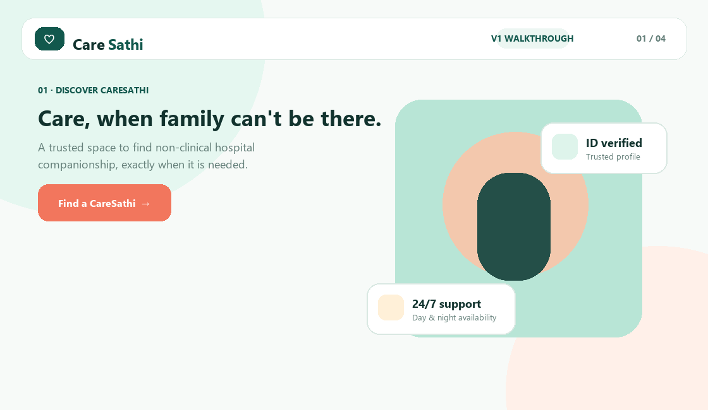

# CareSathi

> Care, when family can't be there.

CareSathi is a V1 platform that connects families with trusted, non-clinical hospital companions. A family can publish a time-bound care request, a nearby CareSathi can accept it, and both sides can track the shift from OTP-secured arrival through completion and feedback.



## Why CareSathi

Hospital admissions can be difficult when relatives are unavailable, live in another city, or need support during night hours. CareSathi is designed for companionship and everyday bedside support—not clinical or emergency care.

## Key capabilities

### For families

- Create requests with hospital, ward, timing, hourly rate, and support requirements.
- Browse nearby CareSathis with ratings, credentials, skills, languages, and matching scores.
- Share a six-digit OTP only when the caretaker arrives; the paid shift timer starts after verification.
- Request an early shift end, pay a booking deposit or final balance in the demo ledger, and download an invoice.
- Rebook from a completed shift, rate the experience, and share a private live-watch link with trusted family members.

### For CareSathis

- View city-matched care opportunities and accept one request at a time.
- Set working hours, preferred hospitals, and unavailable dates.
- Start shifts with the family OTP, release an accepted request with a reason, and end a shift with minute-based payout calculation.
- Track completed shifts, ratings, total earnings, and pending payouts.

### For administrators

- Approve caretaker profiles.
- Suspend or restore accounts.
- Review request status, ratings, completed-shift value, and marketplace activity from one operations workspace.

## Product flow

```text
Family creates request
        ↓
Matching CareSathi accepts
        ↓
Family shares arrival OTP
        ↓
Shift timer starts
        ↓
Family or caretaker ends shift
        ↓
Final amount, invoice, ratings, and payout status
```

## Technology

| Layer | Technology |
| --- | --- |
| Front end | Vanilla JavaScript, HTML, CSS |
| API | Python standard-library HTTP server |
| Local database | SQLite |
| Production database | PostgreSQL via `DATABASE_URL` and `psycopg` |
| Deployment | Vercel Python Functions |

## Run locally

### Requirements

- Python 3.12 recommended
- No Node.js build step is required

### Start the app

```powershell
python server.py
```

Open [http://localhost:8000](http://localhost:8000).

The local SQLite database is created automatically as `caresathi.db`.

### Local demo accounts

Local demo mode starts with only three role-testing accounts and no patient records or prefilled care requests.

| Role | Email | Password |
| --- | --- | --- |
| Family | `family@demo.in` | `demo123` |
| Caretaker | `caretaker@demo.in` | `demo123` |
| Admin | `admin@demo.in` | `demo123` |

Demo mode defaults to on for local SQLite development. To start locally without demo accounts:

```powershell
$env:CARESATHI_DEMO_MODE = "0"
python server.py
```

## Project structure

```text
api/index.py                    Vercel Function entry point
public/                         SPA files and walkthrough GIF
  assets/caresathi-v1-walkthrough.gif
server.py                       API, authentication, database schema, business rules
tests/test_server.py            Backend flow tests
vercel.json                     Vercel API and SPA routing
```

## Test

```powershell
python -m unittest discover -s tests -v
```

The test suite covers demo setup, city matching, password hashing, request acceptance, OTP shift start, early end, payouts, ratings, live watch, and request release.

## Publish to GitHub

The database, backups, environment files, and Vercel metadata are already excluded by `.gitignore`.

```powershell
git add .
git commit -m "Prepare CareSathi V1"
git remote add origin https://github.com/YOUR_USERNAME/caresathi.git
git push -u origin main
```

If Git asks for your identity, configure it with your own verified details:

```powershell
git config user.name "YOUR_NAME"
git config user.email "YOUR_GITHUB_EMAIL"
```

## Deploy to Vercel

Do not deploy the local SQLite database. Vercel Functions have an ephemeral filesystem, so production requires PostgreSQL.

1. Push this repository to GitHub.
2. In Vercel, choose **Add New → Project** and import the repository.
3. Use the **Other** framework preset. [vercel.json](vercel.json) already configures the Python API and SPA routes.
4. Add a PostgreSQL integration such as Neon from Vercel Storage / Marketplace.
5. Add these **Production** environment variables in Vercel:

   | Variable | Value |
   | --- | --- |
   | `DATABASE_URL` | PostgreSQL connection string supplied by the integration |
   | `CARESATHI_DEMO_MODE` | `0` |
   | `CARESATHI_ADMIN_EMAIL` | Your private admin email |
   | `CARESATHI_ADMIN_PASSWORD` | A long, unique password |

6. Deploy the project.
7. Verify the deployment at `https://YOUR_DOMAIN/api/health`:

```json
{"ok": true, "database": "postgres"}
```

Production starts with no sample patients, sample care requests, sample ratings, or public demo passwords. The configured private admin account is created during initialization.

## Important production notes

- The payment screens are a demo ledger; they do not collect money or integrate with a payment gateway.
- CareSathi provides non-clinical companionship and bedside assistance only. For emergencies, contact hospital staff or emergency services.
- Before handling real patient information, add real identity/background checks, phone and email verification, password reset, payment escrow, rate limiting, audit logs, privacy/retention policies, and independent security and legal reviews.

## License

This project is currently private and unlicensed. Add a license before distributing or accepting external contributions.
